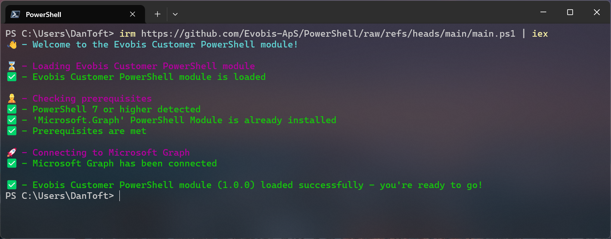

# Evobis Customer PowerShell module

> [!NOTE]
> This library is in preview, and is subject to change.

This is a PowerShell library/module that is designed to aid [Evobis](https://evobis.dk) customers in managing their tenant.

These cmdlets aren't meant to be used for automations, but rather as a way to provide a simple interface to the more complex tasks that are often needed when working with development across Microsoft 365, such as managing permissions that don't yet have a GUI provided by Microsoft.

## Installation/Getting started

> [!IMPORTANT]
> This module is designed to be run with PowerShell 7.x and above, and **WILL NOT** work with Windows PowerShell. 

The solution isn't a "module" in the sense that you don't install it on your machine. Instead you just run it from the repository, when needed, and then it's only available in the current session.

To use it, simply run the following command in a PowerShell session:

```powershell
irm https://raw.githubusercontent.com/Evobis-ApS/PowerShell/refs/heads/main/main.ps1 | iex
```

You'll be prompted to sign in to the `Microsoft Graph Command Line Tools` application, this is the backing of our cmdlets, and is used to authenticate and authorize the cmdlets, simply follow the instructions in the browser.

If everything goes well, you should see the following, and you're ready to use the cmdlets:



## Cmdlets

There are loads of service cmdlets available, those aren't intended to be used directly, but are instead called via the other cmdlets, the following are the ones intended for 'public usage'.

### Add-EBPermissionsToManagedIdentity

This cmdlet is used to add permissions to a managed identity.

#### Example

```powershell
Add-EBPermissionsToManagedIdentity -ManagedIdentityObjectId "b8ef0ce0-2e99-4950-8bfd-713fb0ce810a" -SharePointScopes Sites.FullControl.All -GraphScopes Directory.Read.All, Mail.Send
```

#### Parameters

- `-ManagedIdentityObjectId`: **Guid** The object id of the managed identity.
- `-SharePointScopes`: **string\[\]** The SharePoint scopes to add, these support autocomplete of the possible scopes, and allow multiple, simply by separating them with a `,`.
- `-GraphScopes`: **string\[\]** The Graph scopes to add, these support autocomplete of the possible scopes, and allow multiple, simply by separating them with a `,`.

### Add-EBSitesSelectedPermissionToSite

This cmdlet allows you to grant an application access to a single SharePoint site, this is useful when you want to grant access to a site, rather than using the all mighty `Sites.FullControl.All`, but instead the `Sites.Selected`.

#### Example

```powershell
Add-EBSitesSelectedPermissionToSite -ClientId "<Guid>" -SiteUrl "https://<tenant>.sharepoint.com/sites/<site>" -Permission read
```

#### Parameters

- `-ClientId`/`-ObjectId`: **Guid** The ClientId of the application, or the ObjectId of the managed identity.
- `-SiteUrl`: **string** The URL of the site to grant access to, without any trailing slashes.
- `-Permission`: **string** The permission to grant, this can be `read`, `write`

## Changes

### 0.0.1

This is the initial release of the module, and contains the following cmdlets:

- `Add-EBPermissionsToManagedIdentity`
- `Add-EBSitesSelectedPermissionToSite`

More to come in the future.

## Contributing

Since this is a library intended for internal use, we don't expect any contributions, but if you find any issues, please report them to your consultant at [Evobis](https://evobis.dk/om-evobis/our-team/), or feel free to fork the repository, and provide a fix, we'll be happy to look over your contributions.

## Issues

If you find any issues, please contact your consultant at [Evobis](https://evobis.dk/om-evobis/our-team/).

## Contributors

- [Dan Toft](https://dan.toft.dk)